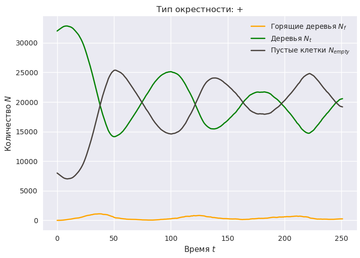

# Лабораторная работа №1 "Клеточный автомат "Лесной пожар""

---

Лес моделируется клеточным полем размером $m \times n$, в котором изначально в $T$ клетках есть деревья.
В остальных клетках деревьев нет.

Цвет клетки с деревом зелёный, без дерева - чёрный, с горящим деревом - оранжевый.

Изначально есть $F$ горящих деревьев. Их координаты (ячейки) выбираются случайным образом.

## Правила клеточного автомата

1. Дерево, в окрестности которого есть хотя бы одно горящее дерево, загорается.
2. На месте сгоревшего дерева образуется пустая ячейка.
3. На месте пустой ячейки с вероятностью $p_g$ вырастает дерево, если в окрестности нет горящих деревьев.
4. Любое дерево может загореться с заданной вероятностью $p_f$.

## Требуется

1. Запрограммировать клеточный автомат.
2. Исследовать процесс лесного пожара, например, накапливая статистику количества горящих $N_f$ и негорящих $N_t$ деревьев, пустых ячеек $N_{ec}$ и др.
3. Исследовать влияние двух форм окрестности $\Theta = \{ \theta_+, \theta_\times \}$ ("+"-окрестность и окрестность фон-Неймана соответственно) на процесс распространения пожара.
4. Обработав накопленную статистику, построить зависимость распространения пожара в зависимости от времени, формы окресности и/или от других факторов $N_f = f(t, \Theta, \ldots)$.
5. Оцените производительность компьютерной модели.
6. Составить отчёт о ЛР. В отчёте ответить на вопросы ниже.

## Вопросы

1. По вашему мнению, достаточно ли реалистична разработанная модель лесного пожара?
2. Если нет, то как можно её улучшить, сделать более реалистичной?
3. Достаточна ли вычислительная производительность программы на ваш взгляд? Можно ли её улучшить? Как?

На данные вопросы требуется ответить в отчёте.

## Требования к отчёту

---

1. Титульный лист.
2. Цели и задачи лабораторной работы (ЛР).
3. Теоретическая часть:
   * описание алгоритма моделирования (блок-схема или псевдокод);
   * достоинства и недостатки клетчатых автоматов.
4. Практическая часть:
   * графики;
   * краткие, но содержательные комментарии к графикам.
5. Заключение. Ответы на поставленные вопросы.

**Цель** - закрепить знания и получить опыт создания и применения клетчатых автоматов для моделирования различных процессов.

**Задачи:**

1. Запрограммировать клетчатый автомат "Лесной пожар".
2. Построить график зависимости от времени количества горящих, сгоревших и целых деревьев
3. Оформить отчёт по ЛР.

## Варианты

---

Группа делится на 4 варианта.

Исходные данные:

* $m = 200$;
* $n = 200$;
* $T = 0.8 \cdot m \cdot n$;
* $F = 1$;
* $p_f = 2 \cdot 10^{-5}$;
* $p_g = 0.02$;
* "затравка" генератора чисел `seed = 1013`;
* число итераций по времени `time_iters = 500`.

Изменения в исходных данных в зависимости от варианта:

* Вариант 1: $p_f = (2, 3, 4) \cdot 10^{-5}$ (три различных значения параметра).
* Вариант 2: $p_g = (8, 16, 32) \cdot 10^{-3}$.
* Вариант 3: $T = (1/3, 2/3, 1) \cdot m \cdot n$.
* Вариант 4: $F = (1, 3, 9)$.

## Примеры графиков

---

